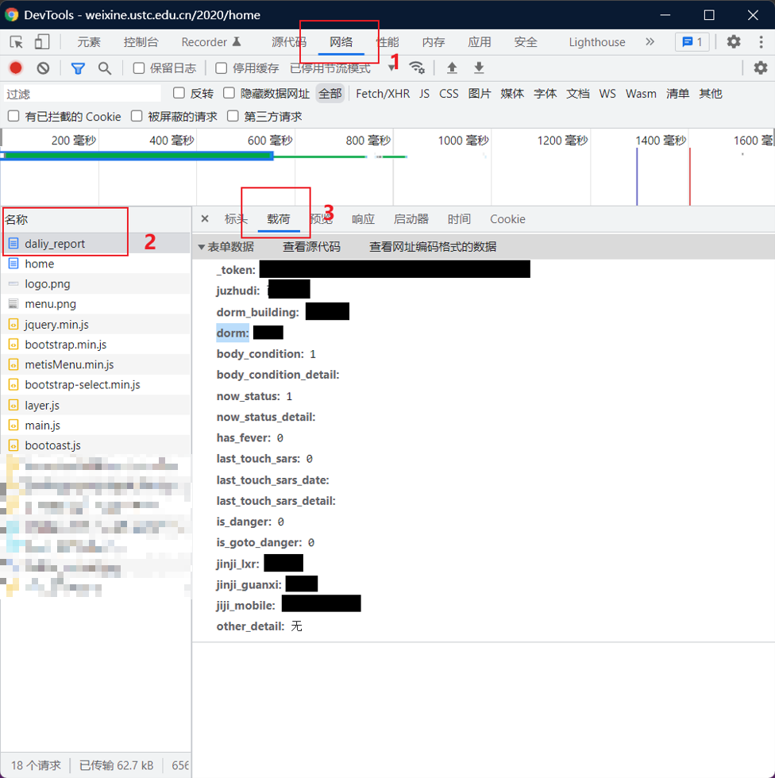

# USTC-nCoV-Report

中国科学技术大学健康打卡平台 (<https://weixine.ustc.edu.cn/2020/login>) 每日信息自动上报, 本项目可以同时为多个人实现定时打卡功能, 只需将每个人的信息填入 `report.ini` 文件即可.

## 更新日志

**2022年3月31日**

再次修改 `report.ini` 以适应上报内容变化.

**2022年3月19日**

修改 `report.ini` 以适应上报内容变化, 近期可能会增加每日自动提交出校申请报备功能.

(2022年4月4日，鉴于学校会严查审批出校申请~~为了避免查水表~~，近期不会增加跨校区自动报备的功能)

**2021年9月13日**

第一版

## 内容列表

- [USTC-nCoV-Report](#ustc-ncov-report)
  - [更新日志](#更新日志)
  - [内容列表](#内容列表)
  - [背景](#背景)
  - [安装](#安装)
  - [使用说明](#使用说明)
  - [示例](#示例)
  - [上报内容变化导致失败的解决办法](#上报内容变化导致失败的解决办法)
  - [使用许可](#使用许可)

## 背景

每天打卡太麻烦了, 容易忘~~吃饱了撑的~~, 决定写一个脚本挂服务器上.

## 安装

本项目需要Python 3.7或更高版本, 低版本未作测试.

安装 requests 库:

```sh
python3 -m pip install requests
```

安装 BeautifulSoup 库:

```sh
python3 -m pip install beautifulsoup4
```

## 使用说明

在目录下的 `report.ini` 文件夹下填入一个或多个人的信息, 然后执行:

```sh
python3 main.py
```

即可完成一次批量上报, 可以挂在服务器上使用 crontab 完成每日定时打卡, 如在每天早晨七点定时打卡:

```txt
0 7 * * * python3 /home/yourname/task/main.py
```

## 示例

这是一份 `report.ini` 文件示例, 包含两个人的信息(一个 section 对应一个人):

```ini
# 说明:
# 所有留空的选项, 不需要, 也不应填写
# 在此文件中增加若干 section, 可为多个人实现自动化打卡操作
# 任一 section 的标题(如 "tom")均可随便填

# 修改记录:
# 2022年3月19日 增加  "现居地"  选项
# 2022年3月31日 针对在校状态, 增加  "具体宿舍"  选项

[Tom]

# 用户名及学号
username = SA210000000
password = 1234567

_token = 

# 现居地
# 该项直接填写中文字符串即可, 如：
# 东校区
# 西校区
# 南校区
# 北校区
# 中校区
# 高新校区
# 先研院
# 国金院
# 合肥市内校外
# 合肥市外校区
juzhudi = 西校区

# 2022年3月31日更新
# 如实填写即可, 若处于不在校状态, 注释以下两行内容
dorm_building = 1号楼
dorm = 101

# 当前身体状况
# 1 正常
# 2 疑似
# 3 确诊
# 4 其它
body_condition = 1
body_condition_detail = 

# 当前状态
# 1 正常在校园内
# 2 正常在家
# 3 居家留观     
# 4 集中留观
# 5 住院治疗
# 6 其它
now_status = 1
now_status_detail = 

# 目前有无发热症状
# 0 无
# 1 有
has_fever = 0

# 是否接触过确诊或疑似病例的患者
# 0 无
# 1 有
last_touch_sars = 0
last_touch_sars_date = 
last_touch_sars_detail = 

# 当前居住地是否为疫情中高风险地区
# 0 否
# 1 是
is_danger = 0

# 14天内是否有疫情中高风险地区旅居史
# 0 无
# 1 有
is_goto_danger = 0

# 紧急联系人
jinji_lxr = Jack

# 紧急联系人与本人关系
jinji_guanxi = 父亲

# 紧急联系人电话
# jiji 不是我写错, 实际 post 的数据就是这样
jiji_mobile = 13500000000

# 其它情况说明
other_detail = 无

[Jack]
# 第二个人

username = SA210000001
password = 1234567

_token = 

juzhudi = 西校区
dorm_building = 1号楼
dorm = 101
body_condition = 1
body_condition_detail = 
now_status = 1
now_status_detail = 
has_fever = 0
last_touch_sars = 0
last_touch_sars_date = 
last_touch_sars_detail = 
is_danger = 0
is_goto_danger = 0
jinji_lxr = Tom
jinji_guanxi = 儿子
jiji_mobile = 13500000001
other_detail = 无
```

## 上报内容变化导致失败的解决办法

由于学校近期报表内容频繁变化. 如果发现上报内容变化导致上报失败, 可以直接开 issue 提醒我修改, 也可以自行修改 `report.ini` 文件.

这里简单讲一下如何找出正确的 `report.ini` 文件.

1. 浏览器打开[中国科大健康打卡平台](https://weixine.ustc.edu.cn/2020/home), 登录进入 "信息上报" 页面;

2. 打开浏览器的开发者模式（Chrome直接在页面空白处右键, 再点击 "检查" 即可）, 然后切换到 "网络" 选项卡;

3. 填写信息, 点击页面上的 "确认上报" 按钮;

4. 在 DevTools 中找到 `daily_report` 文件, 查看 "载荷" ;

5. 将信息填入 `report.ini` 文件.



## 使用许可

[MIT License](LICENSE)
